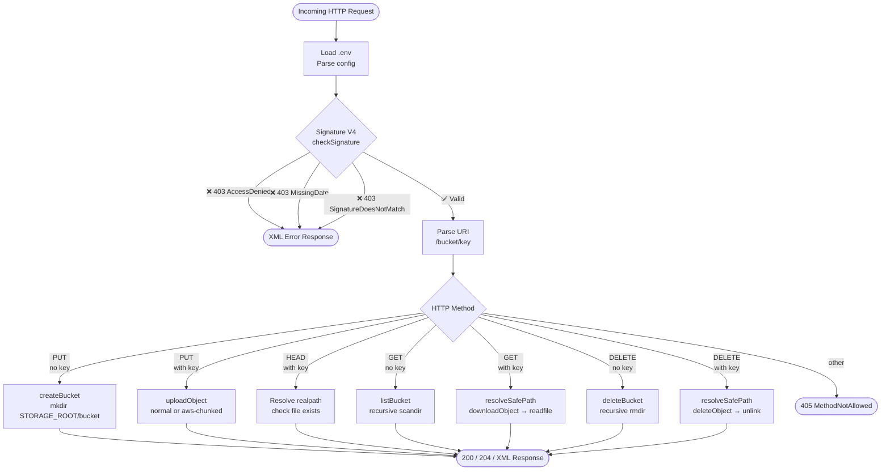
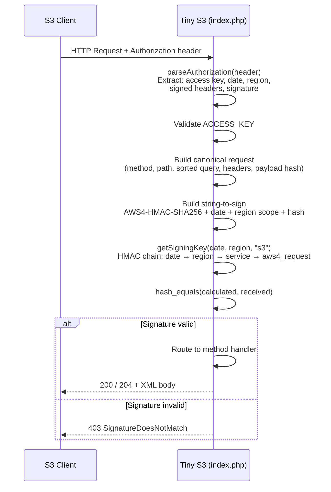
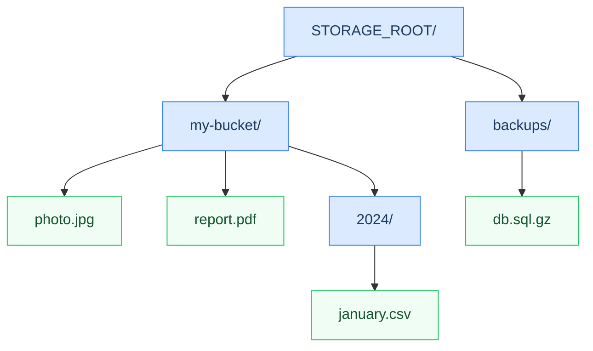

# Tiny S3

A minimal **AWS S3-compatible storage server** written in a single PHP file.  
It implements AWS Signature V4 authentication and supports the core S3 operations — enough to work with clients like `rclone`, `boto3`, and the AWS CLI.

All objects are stored as plain files on the local filesystem, with no database and no external dependencies.

---

## How It Works



---

## AWS Signature V4 Verification Flow



---

## Filesystem Layout



Each **bucket** is a directory. Each **object key** maps directly to a file path. Keys containing `/` create subdirectories automatically on upload.

---

## Supported Operations

| Method | URL pattern        | Operation              | Success code |
|--------|--------------------|------------------------|:------------:|
| `PUT`  | `/bucket`          | Create bucket          | 200          |
| `PUT`  | `/bucket/key`      | Upload object          | 200 + ETag   |
| `GET`  | `/bucket`          | List objects in bucket | 200 XML      |
| `GET`  | `/bucket/key`      | Download object        | 200 stream   |
| `HEAD` | `/bucket/key`      | Check object exists    | 200 / 404    |
| `DELETE` | `/bucket`        | Delete bucket (recursive) | 204       |
| `DELETE` | `/bucket/key`    | Delete object          | 204          |

---

## Setup

### Requirements

- PHP 8.1 or later (uses `match`, `str_starts_with`, `never` return type)
- A web server that routes all requests to `index.php` (Apache, Nginx, Caddy, or PHP built-in)

### Installation

```bash
# 1. Clone or copy index.php to your web root
git clone https://github.com/you/tiny-s3.git /var/www/tiny-s3
cd /var/www/tiny-s3

# 2. Create your .env file from the template
cp .env.template .env
nano .env   # fill in ACCESS_KEY, SECRET_KEY, etc.

# 3. Create the storage directory (parent of STORAGE_ROOT)
mkdir -p /var/www/data
chown www-data:www-data /var/www/data

# 4. Make the log file writable if you enable DEBUG
touch activities.log
chown www-data:www-data activities.log
```

### Apache — route all requests to index.php

```apacheconf
# .htaccess
RewriteEngine On
RewriteCond %{REQUEST_FILENAME} !-f
RewriteRule ^ index.php [QSA,L]
```

### Nginx

```nginx
location / {
    try_files $uri $uri/ /index.php$is_args$args;
}
location ~ \.php$ {
    fastcgi_pass unix:/run/php/php8.2-fpm.sock;
    include fastcgi_params;
    fastcgi_param SCRIPT_FILENAME $document_root$fastcgi_script_name;
}
```

### PHP built-in server (development only)

```bash
php -S 0.0.0.0:8080 index.php
```

---

## Configuration

All configuration is read from the `.env` file in the same directory as `index.php`.  
See `.env.template` for full documentation of every variable.

| Variable       | Default          | Description |
|----------------|------------------|-------------|
| `DEBUG`        | `false`          | Append detailed request logs to `LOG_FILE` |
| `ACCESS_KEY`   | *(required)*     | Client-facing access key ID |
| `SECRET_KEY`   | *(required)*     | Secret used to verify HMAC-SHA256 signatures |
| `REGION`       | `us-east-1`      | Region string in the Signature V4 credential scope |
| `STORAGE_ROOT` | `../data`        | Root directory for buckets and objects |
| `LOG_FILE`     | `activities.log` | Log file path (relative to `index.php`) |

---

## Client Examples

### AWS CLI

```bash
aws s3 mb s3://my-bucket \
  --endpoint-url http://localhost:8080 \
  --no-verify-ssl

aws s3 cp file.txt s3://my-bucket/file.txt \
  --endpoint-url http://localhost:8080
```

Set credentials in `~/.aws/credentials` or via environment variables:

```bash
export AWS_ACCESS_KEY_ID=your-access-key-here
export AWS_SECRET_ACCESS_KEY=your-secret-key-here
export AWS_DEFAULT_REGION=us-east-1
```

### Python (boto3)

```python
import boto3

s3 = boto3.client(
    's3',
    endpoint_url='http://localhost:8080',
    aws_access_key_id='your-access-key-here',
    aws_secret_access_key='your-secret-key-here',
    region_name='us-east-1',
)

s3.create_bucket(Bucket='my-bucket')
s3.upload_file('file.txt', 'my-bucket', 'file.txt')
```

### rclone

```ini
# ~/.config/rclone/rclone.conf
[tinys3]
type = s3
provider = Other
access_key_id = your-access-key-here
secret_access_key = your-secret-key-here
region = us-east-1
endpoint = http://localhost:8080
```

```bash
rclone ls tinys3:my-bucket
rclone copy file.txt tinys3:my-bucket/
```

---

## Security Notes

- **Path traversal protection** — all GET and DELETE operations resolve the object key with `realpath()` and verify the result stays inside the bucket directory before any file access or deletion.
- **Timing-safe comparison** — signatures are compared with `hash_equals()` to prevent timing attacks.
- **DEBUG mode** — logs full Authorization headers and signature internals. Always set `DEBUG = false` in production.
- **HTTPS** — use a reverse proxy (Nginx, Caddy) with TLS in production. The built-in PHP server is plaintext only.
- **Directory permissions** — `STORAGE_ROOT` should not be web-accessible. Place it outside the document root.

---

## What Is Not Implemented

This is intentionally minimal. The following S3 features are **not** supported:

- Multipart uploads (`CreateMultipartUpload` / `UploadPart` / `CompleteMultipartUpload`)
- Object versioning
- Pre-signed URLs
- ACLs and bucket policies
- Server-side encryption
- Object metadata (`x-amz-meta-*` headers)
- Pagination for bucket listings (`max-keys`, `prefix`, `marker`)
- Bucket location / region API endpoints

---

## License

MIT
