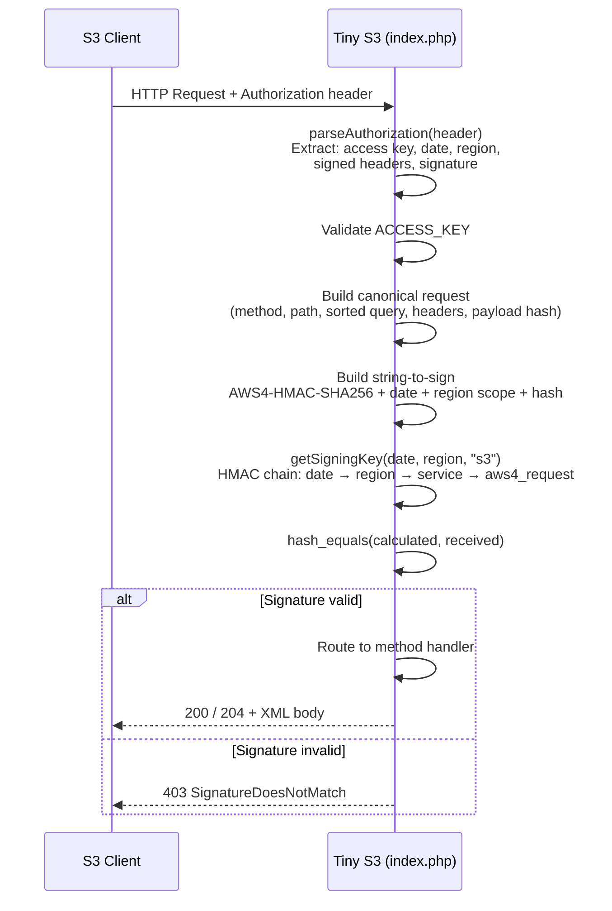
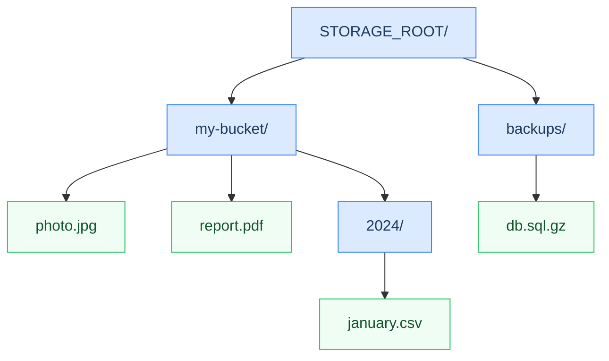

# Tiny S3

A minimal **AWS S3-compatible storage server** written in a single PHP file.  
It implements AWS Signature V4 authentication and supports the core S3 operations — enough to work with clients like `rclone`, `boto3`, and the AWS CLI.

All objects are stored as plain files on the local filesystem, with no database and no external dependencies.

---

## How It Works


---

## AWS Signature V4 Verification Flow



---

## Filesystem Layout



Each **bucket** is a directory. Each **object key** maps directly to a file path. Keys containing `/` create subdirectories automatically on upload.

---

## Supported Operations

| Method | URL pattern        | Operation              | Success code |
|--------|--------------------|------------------------|:------------:|
| `PUT`  | `/bucket`          | Create bucket          | 200          |
| `PUT`  | `/bucket/key`      | Upload object          | 200 + ETag   |
| `GET`  | `/bucket`          | List objects in bucket | 200 XML      |
| `GET`  | `/bucket/key`      | Download object        | 200 stream   |
| `HEAD` | `/bucket/key`      | Check object exists    | 200 / 404    |
| `DELETE` | `/bucket`        | Delete bucket (recursive) | 204       |
| `DELETE` | `/bucket/key`    | Delete object          | 204          |

---

## Setup

### Requirements

- PHP 8.1 or later (uses `match`, `str_starts_with`, `never` return type)
- A web server that routes all requests to `index.php` (Apache, Nginx, Caddy, or PHP built-in)

### Installation

```bash
# 1. Clone or copy index.php to your web root
git clone https://github.com/franciscoteixeira/tiny-s3.git /var/www/tiny-s3
cd /var/www/tiny-s3

# 2. Install dev dependencies (PHPUnit + Guzzle — skip if you don't need tests)
composer install

# 3. Create your .env file from the template
cp .env.template .env
nano .env   # fill in ACCESS_KEY, SECRET_KEY, etc.

# 4. Create the storage directory (parent of STORAGE_ROOT)
mkdir -p /var/www/data
chown www-data:www-data /var/www/data

# 5. The log file is created automatically on first startup.
#    Ensure the web server user can write to the project directory, or set
#    LOG_FILE to an absolute path the server can write to (e.g. /var/log/tiny-s3.log).
```

### Apache — route all requests to index.php

```apacheconf
# .htaccess
RewriteEngine On
RewriteCond %{REQUEST_FILENAME} !-f
RewriteRule ^ index.php [QSA,L]
```

### Nginx

```nginx
location / {
    try_files $uri $uri/ /index.php$is_args$args;
}
location ~ \.php$ {
    fastcgi_pass unix:/run/php/php8.2-fpm.sock;
    include fastcgi_params;
    fastcgi_param SCRIPT_FILENAME $document_root$fastcgi_script_name;
}
```

### PHP built-in server (development only)

```bash
composer start
```

This runs `php -S localhost:9000 index.php`. To bind to all interfaces instead
(e.g. to reach the server from another machine on the same network):

```bash
php -S 0.0.0.0:9000 index.php
```

---

## Configuration

All configuration is read from the `.env` file in the same directory as `index.php`.  
See `.env.template` for full documentation of every variable.

| Variable       | Default          | Description |
|----------------|------------------|-------------|
| `DEBUG`        | `false`          | Append detailed request logs to `LOG_FILE` |
| `ACCESS_KEY`   | *(required)*     | Client-facing access key ID |
| `SECRET_KEY`   | *(required)*     | Secret used to verify HMAC-SHA256 signatures |
| `REGION`       | `us-east-1`      | Region string in the Signature V4 credential scope |
| `ALLOWED_IPS`  | *(empty)*        | Comma/space-separated IPs and CIDR ranges allowed to connect; empty or `*` disables the check |
| `STORAGE_ROOT` | `../data`        | Root directory for buckets and objects |
| `LOG_FILE`     | `activities.log` | Log file path (relative to `index.php`); created automatically at startup |

---

## Client Examples

### AWS CLI

```bash
aws s3 mb s3://my-bucket \
  --endpoint-url http://localhost:9000 \
  --no-verify-ssl

aws s3 cp file.txt s3://my-bucket/file.txt \
  --endpoint-url http://localhost:9000
```

Set credentials in `~/.aws/credentials` or via environment variables:

```bash
export AWS_ACCESS_KEY_ID=your-access-key-here
export AWS_SECRET_ACCESS_KEY=your-secret-key-here
export AWS_DEFAULT_REGION=us-east-1
```

### Python (boto3)

```python
import boto3

s3 = boto3.client(
    's3',
    endpoint_url='http://localhost:9000',
    aws_access_key_id='your-access-key-here',
    aws_secret_access_key='your-secret-key-here',
    region_name='us-east-1',
)

s3.create_bucket(Bucket='my-bucket')
s3.upload_file('file.txt', 'my-bucket', 'file.txt')
```

### rclone

```ini
# ~/.config/rclone/rclone.conf
[tinys3]
type = s3
provider = Other
access_key_id = your-access-key-here
secret_access_key = your-secret-key-here
region = us-east-1
endpoint = http://localhost:9000
```

```bash
rclone ls tinys3:my-bucket
rclone copy file.txt tinys3:my-bucket/
```

---

## Testing

There are two complementary ways to test Tiny S3.

### PHPUnit (automated, CI-friendly)

A full PHPUnit suite lives in `tests/`. It requires PHP 8.1+, [Composer](https://getcomposer.org),
and nothing else — the integration suite starts its own PHP built-in server automatically.

```bash
# Install dependencies (first time only)
composer install

# Run the full suite
composer test

# Run only the fast unit tests (no server required)
composer test:unit

# Run only the integration tests
composer test:integration
```

**Suite structure**

```
tests/
├── bootstrap.php               # Autoloader + loads index.php in test-safe mode
├── helpers.php                 # Reference copy of pure functions (kept for documentation)
├── Unit/
│   ├── EnvTest.php             # loadEnv(), envToBool()
│   ├── XmlTest.php             # xmlElement()
│   ├── AuthParserTest.php      # parseAuthorization()
│   ├── SigningKeyTest.php      # getSigningKey() — AWS test vectors
│   └── FileSystemTest.php      # listObjectsRecursively(), deleteDirectoryRecursive()
└── Integration/
    ├── SigV4Signer.php         # PHP port of the HMAC signing chain
    └── S3ServerTest.php        # 17 HTTP tests via Guzzle against a live server
```

Both suites exit with code `0` on full pass and `1` on any failure.

---

### Bash / PowerShell validators

Quick smoke-tests that need only a running server — no Composer, no PHPUnit. Both
implement AWS Signature V4 signing from scratch and run the same 7-step sequence:
create bucket → upload → head → list → download & verify → delete object → delete bucket.

#### Bash (Linux / macOS)

Requires `bash`, `curl`, and `openssl`.

```bash
chmod +x test.sh
./test.sh

# Override any value inline
ENDPOINT=http://192.168.1.10:9000 ACCESS_KEY=mykey SECRET_KEY=mysecret ./test.sh
```

#### PowerShell (Windows / cross-platform)

Requires PowerShell 5.1+ (Windows) or PowerShell 7+ (cross-platform).  
Uses only built-in `System.Security.Cryptography` — no extra modules needed.

```powershell
.\test.ps1
.\test.ps1 -Endpoint http://192.168.1.10:9000 -AccessKey mykey -SecretKey mysecret
```

---

## Code Coverage

Coverage reports are generated by `composer coverage` and written to the `coverage/` directory:

| File | Format | Use |
|------|--------|-----|
| `coverage/html/index.html` | Interactive HTML | Open in browser — line-by-line detail |
| `coverage/clover.xml` | Clover XML | Jenkins Clover PHP plugin |
| `coverage/cobertura.xml` | Cobertura XML | Jenkins Cobertura plugin |
| `coverage/coverage.txt` | Plain text | Build log / artefact |

PHPUnit delegates all coverage instrumentation to a PHP extension. There is no built-in
option — you must have **one** of the following active before running `composer coverage`.

---

### Windows

#### Option A — Xdebug (recommended)

**1. Download the right DLL**

Go to **[xdebug.org/wizard](https://xdebug.org/wizard)**, paste the output of `php -i`,
and click **Analyse**. The wizard shows the exact filename and download link, for example:
`php_xdebug-3.4.2-8.3-vs16-x86_64.dll`.

**2. Find your extension directory**

```powershell
php -i | Select-String "extension_dir"
# e.g. C:\tools\php83\ext
```

Copy the downloaded `.dll` into that folder.

**3. Find and edit `php.ini`**

```powershell
php --ini
# e.g. C:\tools\php83\php.ini
```

Add at the bottom of `php.ini`:

```ini
zend_extension=xdebug
xdebug.mode=coverage
```

**4. Verify**

```powershell
php -m | Select-String xdebug
# should print: xdebug
```

Then run:

```powershell
composer coverage
```

#### Option B — PCOV (if available in your PHP distribution)

Some PHP bundles on Windows include PCOV. Check:

```powershell
php -m | Select-String pcov
```

If it prints `pcov`, just run `composer coverage` — no configuration needed.  
If it prints nothing, use Xdebug (Option A above).

---

### macOS

#### Option A — Homebrew PHP (recommended)

```bash
# Install Xdebug via PECL
pecl install xdebug

# Find php.ini
php --ini

# Add to php.ini:
# zend_extension=xdebug
# xdebug.mode=coverage
```

Or with **Laravel Herd** / **Valet**:

1. Open **Herd → Settings → PHP → Extensions**
2. Enable **Xdebug** or **PCOV**
3. Click Restart PHP

Then run:

```bash
XDEBUG_MODE=coverage composer coverage
# or if PCOV is enabled:
composer coverage
```

#### Option B — Homebrew PCOV (faster, lower overhead)

```bash
pecl install pcov
# add to php.ini: extension=pcov
composer coverage
```

---

### Linux

#### Option A — Xdebug via package manager

**Ubuntu / Debian:**
```bash
sudo apt install php-xdebug

# Add to /etc/php/8.x/cli/php.ini (or conf.d/20-xdebug.ini):
# xdebug.mode=coverage
```

**Fedora / RHEL:**
```bash
sudo dnf install php-xdebug
# xdebug.mode=coverage  →  /etc/php.d/15-xdebug.ini
```

**Alpine (Docker):**
```dockerfile
RUN apk add --no-cache php-xdebug \
 && echo "xdebug.mode=coverage" >> /etc/php83/conf.d/50_xdebug.ini
```

Then run:

```bash
XDEBUG_MODE=coverage composer coverage
```

#### Option B — PCOV via PECL (faster, coverage-only)

```bash
pecl install pcov

# Add to php.ini:
# extension=pcov

composer coverage
```

#### Option C — Docker one-liner (no local install)

```bash
docker run --rm \
  -v "$(pwd)":/app -w /app \
  -e XDEBUG_MODE=coverage \
  php:8.3-cli sh -c "pecl install xdebug && composer coverage"
```

---

### CI / Jenkins

The `Jenkinsfile` at the project root configures a full pipeline. It uses
`XDEBUG_MODE=coverage` on the agent and publishes three report types:

- **HTML Publisher** → interactive `coverage/html/` report linked from the build page
- **Cobertura** → line/branch/method trend chart on the project page
- **JUnit** → test pass/fail trend

Required Jenkins plugins: **HTML Publisher**, **Cobertura**, **JUnit**.

---

## Security Notes

- **IP allowlist** — set `ALLOWED_IPS` in `.env` to restrict access to known IPs or CIDR ranges. The check runs before signature verification, so blocked clients never touch the crypto layer. Supports exact IPv4/IPv6 addresses and CIDR blocks; multiple entries are comma- or space-separated. Leave empty (or set to `*`) to disable. **Loopback addresses (`127.x.x.x`, `::1`) are always allowed automatically** — they can only come from the same server, so a co-hosted Laravel app does not need special configuration.
- **Path traversal protection** — GET and DELETE resolve the object key with `realpath()` and verify the result stays inside the bucket directory. PUT validates the key's components before any file is created, rejecting keys containing `..` segments. HEAD uses the same `realpath()` bounds check as GET/DELETE.
- **Timing-safe comparison** — signatures are compared with `hash_equals()` to prevent timing attacks.
- **DEBUG mode** — logs full Authorization headers and signature internals. Always set `DEBUG = false` in production.
- **HTTPS** — use a reverse proxy (Nginx, Caddy) with TLS in production. The built-in PHP server is plaintext only.
- **Directory permissions** — `STORAGE_ROOT` should not be web-accessible. Place it outside the document root.

---

## Diagnostics

When logging is not working (common on shared hosting where the web root is not writable by PHP), use the built-in diagnostic endpoint to inspect the server's resolved configuration without SSH access.

```
GET https://your-tiny-s3-host/__diag?token=YOUR_SECRET_KEY
```

The token is your `SECRET_KEY` value — only someone who already knows it can read the report. The response is plain text and includes:

- PHP version and SAPI
- `REMOTE_ADDR` as seen by Tiny S3 (useful for diagnosing IP allowlist issues)
- Resolved absolute paths for `STORAGE_ROOT` and `LOG_FILE`, with existence and write-permission checks
- The `sys_get_temp_dir()` fallback path if the configured log file is unwritable
- A live write test to `LOG_FILE`

**Shared hosting log file tip:** if the report shows `LOG_FILE` as `NOT WRITABLE`, add an absolute path to your `.env`:

```dotenv
LOG_FILE = /home/yourusername/logs/tiny-s3.log
```

Tiny S3 automatically falls back to `sys_get_temp_dir()` if the configured path is unwritable, so logging always works even before the path is corrected. The fallback path is shown in the `/__diag` report and in the web-server error log.

---

## What Is Not Implemented

This is intentionally minimal. The following S3 features are **not** supported:

- Multipart uploads (`CreateMultipartUpload` / `UploadPart` / `CompleteMultipartUpload`)
- Object versioning
- Pre-signed URLs
- ACLs and bucket policies
- Server-side encryption
- Object metadata (`x-amz-meta-*` headers)
- Pagination for bucket listings (`max-keys`, `prefix`, `marker`)
- Bucket location / region API endpoints

---

## License

MIT — Copyright © 2026 Francisco Ernesto Teixeira
