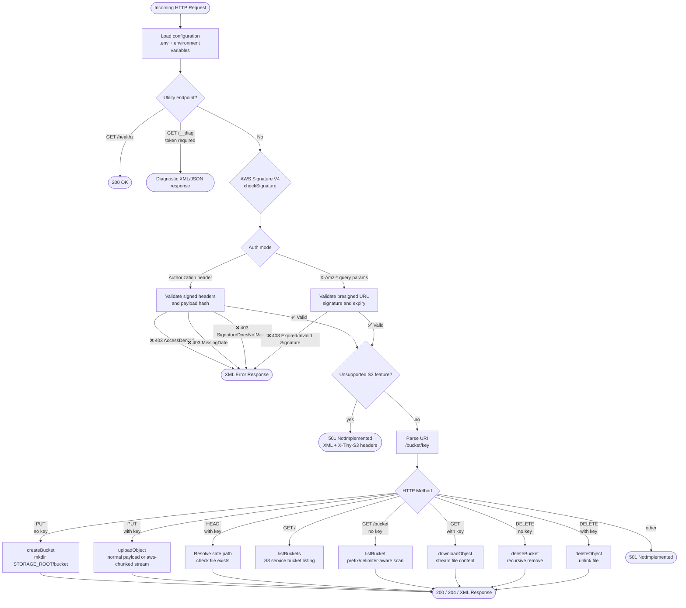
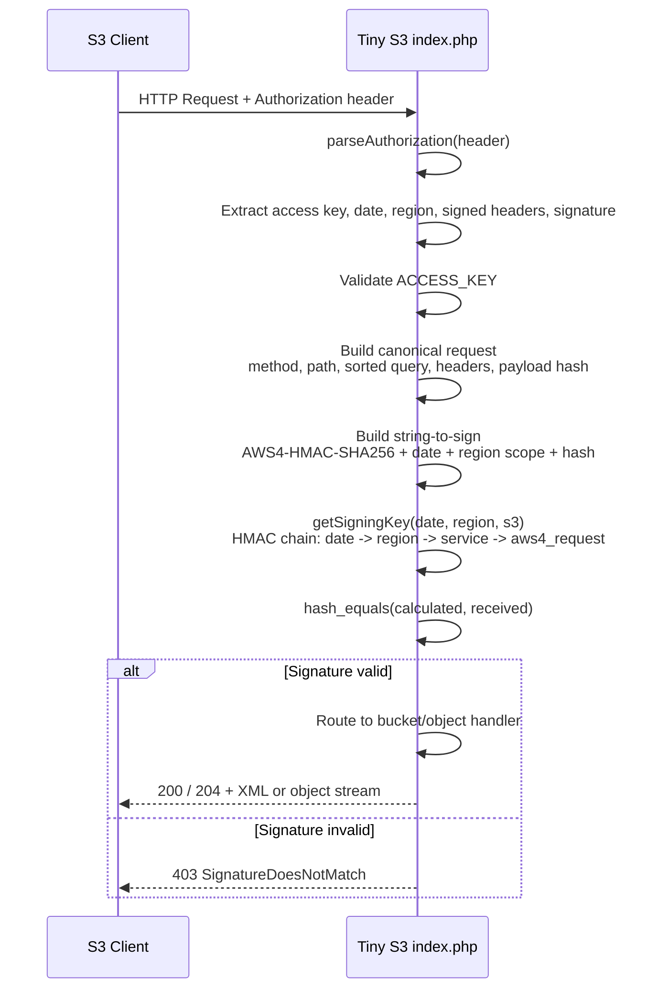
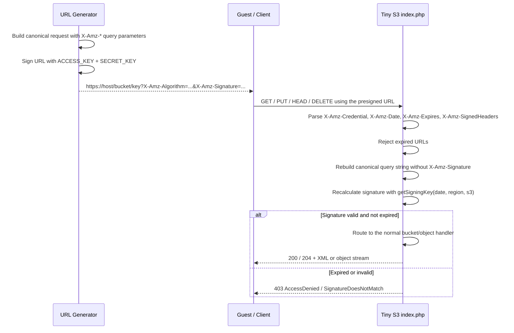
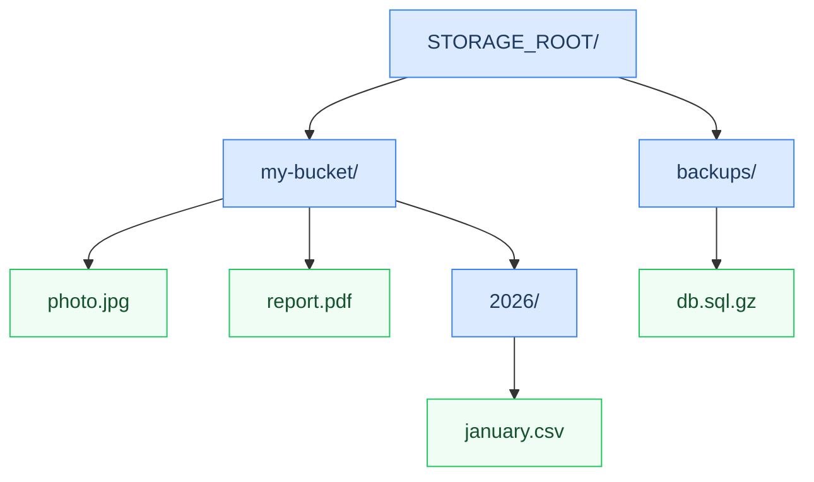

# Tiny S3

Tiny S3 is a minimal **AWS S3-compatible storage emulator** written in pure PHP.

It is designed for small production deployments, internal systems, development environments, and integration tests where a lightweight S3-compatible endpoint is useful without running MinIO, Garage, Ceph, or cloud object storage.

Objects are stored as plain files on the local filesystem. Buckets are directories. Object keys are file paths inside each bucket.

---

## Main Goals

- Minimal functional S3-compatible server.
- Single PHP application entry point: `index.php`.
- No database.
- No mandatory Composer dependencies for runtime.
- AWS Signature V4 verification through Authorization headers and presigned URLs.
- Local filesystem storage.
- Docker-ready runtime using **PHP 8.5 + PHP-FPM + Nginx**.
- Easy deployment to a VPS using either Docker, Nginx, or Apache.

---


## Architecture and Flows

The diagrams below describe the runtime flow, AWS Signature V4 validation, presigned URL validation, and the local filesystem mapping used by Tiny S3.

### Request Lifecycle


```mermaid
flowchart TD
    A([Incoming HTTP Request]) --> B[Load configuration<br/>.env + environment variables]
    B --> C{Utility endpoint?}

    C -- GET /healthz --> HZ([200 OK])
    C -- GET /__diag<br/>token required --> DG([Diagnostic XML/JSON response])
    C -- No --> D{AWS Signature V4<br/>checkSignature}
    D --> D1{Auth mode}
    D1 -- Authorization header --> DH[Validate signed headers<br/>and payload hash]
    D1 -- X-Amz-* query params --> DP[Validate presigned URL<br/>signature and expiry]

    DH -- ❌ 403 AccessDenied --> ERR([XML Error Response])
    DH -- ❌ 403 MissingDate --> ERR
    DH -- ❌ 403 SignatureDoesNotMatch --> ERR
    DP -- ❌ 403 Expired/Invalid Signature --> ERR

    DH -- ✅ Valid --> NI{Unsupported S3 feature?}
    DP -- ✅ Valid --> NI
    NI -- yes --> NERR([501 NotImplemented<br/>XML + X-Tiny-S3 headers])
    NI -- no --> E[Parse URI<br/>/bucket/key]
    E --> F{HTTP Method}

    F -- PUT<br/>no key --> G[createBucket<br/>mkdir STORAGE_ROOT/bucket]
    F -- PUT<br/>with key --> I[uploadObject<br/>normal payload or aws-chunked stream]

    F -- HEAD<br/>with key --> J[Resolve safe path<br/>check file exists]

    F -- GET / --> R[listBuckets<br/>S3 service bucket listing]
    F -- GET /bucket<br/>no key --> K[listBucket<br/>prefix/delimiter-aware scan]
    F -- GET<br/>with key --> L[downloadObject<br/>stream file content]

    F -- DELETE<br/>no key --> M[deleteBucket<br/>recursive remove]
    F -- DELETE<br/>with key --> N[deleteObject<br/>unlink file]

    F -- other --> O([501 NotImplemented])

    G --> OK([200 / 204 / XML Response])
    I --> OK
    J --> OK
    K --> OK
    L --> OK
    M --> OK
    N --> OK
```

### AWS Signature V4 Authorization Header Flow


```mermaid
sequenceDiagram
    participant C as S3 Client
    participant S as Tiny S3 index.php

    C->>S: HTTP Request + Authorization header

    S->>S: parseAuthorization(header)
    S->>S: Extract access key, date, region, signed headers, signature
    S->>S: Validate ACCESS_KEY

    S->>S: Build canonical request<br/>method, path, sorted query, headers, payload hash
    S->>S: Build string-to-sign<br/>AWS4-HMAC-SHA256 + date + region scope + hash
    S->>S: getSigningKey(date, region, s3)<br/>HMAC chain: date -> region -> service -> aws4_request
    S->>S: hash_equals(calculated, received)

    alt Signature valid
        S->>S: Route to bucket/object handler
        S-->>C: 200 / 204 + XML or object stream
    else Signature invalid
        S-->>C: 403 SignatureDoesNotMatch
    end
```

### AWS Signature V4 Presigned URL Flow


```mermaid
sequenceDiagram
    participant G as URL Generator
    participant C as Guest / Client
    participant S as Tiny S3 index.php

    G->>G: Build canonical request with X-Amz-* query parameters
    G->>G: Sign URL with ACCESS_KEY + SECRET_KEY
    G-->>C: https://host/bucket/key?X-Amz-Algorithm=...&X-Amz-Signature=...

    C->>S: GET / PUT / HEAD / DELETE using the presigned URL
    S->>S: Parse X-Amz-Credential, X-Amz-Date, X-Amz-Expires, X-Amz-SignedHeaders
    S->>S: Reject expired URLs
    S->>S: Rebuild canonical query string without X-Amz-Signature
    S->>S: Recalculate signature with getSigningKey(date, region, s3)

    alt Signature valid and not expired
        S->>S: Route to the normal bucket/object handler
        S-->>C: 200 / 204 + XML or object stream
    else Expired or invalid
        S-->>C: 403 AccessDenied / SignatureDoesNotMatch
    end
```

### Filesystem Layout


```mermaid
graph TD
    R["STORAGE_ROOT/"]:::dir
    R --> B1["my-bucket/"]:::dir
    R --> B2["backups/"]:::dir
    B1 --> F1["photo.jpg"]:::file
    B1 --> F2["report.pdf"]:::file
    B1 --> SD["2026/"]:::dir
    SD --> F3["january.csv"]:::file
    B2 --> F4["db.sql.gz"]:::file

    classDef dir  fill:#dbeafe,stroke:#3b82f6,color:#1e3a5f
    classDef file fill:#f0fdf4,stroke:#22c55e,color:#14532d
```

Each **bucket** is a directory. Each **object key** maps directly to a file path. Keys containing `/` create subdirectories automatically on upload. Zero-byte folder markers sent by GUI clients, for example `PUT /bucket/uploads/`, are stored as real directories so nested uploads such as `uploads/people/photo.jpg` work correctly on a filesystem-backed store.

---

## Supported Operations

| Method | URL pattern | Operation | Auth modes | Success code |
|---|---|---|---|---:|
| `PUT` | `/bucket` | Create bucket | Header / presigned URL | `200` |
| `PUT` | `/bucket/key` | Upload object | Header / presigned URL | `200` |
| `GET` | `/` | List all buckets using the S3 `ListAllMyBucketsResult` XML shape | Header / presigned URL | `200` |
| `GET` | `/bucket` | List bucket objects, including `prefix`, `delimiter`, `max-keys`, and basic `list-type=2` | Header / presigned URL | `200` |
| `GET` | `/bucket?location` | Return bucket region using the S3 `LocationConstraint` XML shape | Header / presigned URL | `200` |
| `GET` | `/bucket?uploads` | Return an empty multipart upload listing for client compatibility | Header / presigned URL | `200` |
| `GET` | `/bucket?versioning` | Return an empty versioning configuration, meaning versioning is disabled | Header / presigned URL | `200` |
| `GET` | `/bucket/key` | Download object | Header / presigned URL | `200` |
| `HEAD` | `/bucket/key` | Check object existence | Header / presigned URL | `200` / `404` |
| `DELETE` | `/bucket` | Delete bucket recursively | Header / presigned URL | `204` |
| `DELETE` | `/bucket/key` | Delete object | Header / presigned URL | `204` |
| `GET` | `/healthz` | Runtime healthcheck | None | `200` |
| `GET` | `/__diag?token=SECRET_KEY` | Diagnostic report | Token | `200` |

---

## Current Limitations

Tiny S3 intentionally implements only the basic S3 subset needed by many applications.

It does **not** currently implement:

- Multipart upload API for actual upload/create/complete/part operations. `GET ?uploads` returns an empty official-compatible listing so GUI clients can browse normally.
- Bucket policies.
- ACLs.
- Object tagging.
- Object versioning storage/history. `GET ?versioning` returns an empty official-compatible configuration so GUI clients and SDKs can continue browsing.
- S3 event notifications.
- Server-side encryption metadata compatibility.
- Full ListObjectsV2 pagination with continuation tokens.
- Real AWS IAM semantics.

Use it when you need a compact S3-compatible storage endpoint, not a full AWS S3 clone.

### Unsupported feature notification

When a client requests a known S3 feature that Tiny S3 does not implement, Tiny S3 now answers explicitly instead of failing silently. The response is:

- HTTP `501 NotImplemented`.
- XML error body with `<Code>NotImplemented</Code>`.
- `X-Tiny-S3-Not-Implemented` response header describing the unsupported feature.
- `X-Tiny-S3-Supported-Operations` response header listing the supported subset.

Examples that intentionally return `501 NotImplemented`:

Note: `GET /bucket?uploads` and `GET /bucket?versioning` are handled as official-compatible read/probe responses, but multipart upload creation/completion and real object version history remain unsupported.

```text
POST /bucket/key
PUT /bucket/key?acl
POST /bucket/key?uploads
PUT /bucket/key?partNumber=1&uploadId=...
```

This is useful for guests, SDKs, and integration tests because the caller receives a clear answer: the endpoint is alive, the request was understood, but that S3 feature is outside the supported Tiny S3 subset.

---

## Configuration

Configuration can be provided in two ways:

1. Real environment variables, especially when running with Docker or Docker Compose.
2. A local `.env` file next to `index.php`.

When the same variable exists in both places, the real environment variable wins. This is important for containers and CI/CD because injected secrets must override local defaults.

Start from the template:

```bash
cp .env.template .env
nano .env
```

### Variables

| Variable | Default | Description |
|---|---|---|
| `DEBUG` | `false` | Enables verbose request/signature logs. Keep `false` in production. |
| `ACCESS_KEY` | required | S3 access key used by clients. |
| `SECRET_KEY` | required | Secret used to verify AWS Signature V4 requests. |
| `REGION` | `us-east-1` | Region expected in the Signature V4 credential scope. |
| `ALLOWED_IPS` | empty | Optional comma/space-separated IP or CIDR allowlist. Empty or `*` allows all. |
| `STORAGE_ROOT` | `./data` or Docker `/var/lib/tiny-s3` | Root directory where buckets and objects are stored. |
| `LOG_FILE` | `activities.log` or Docker `/var/log/tiny-s3/activities.log` | Activity log file. Errors and warnings are always logged. |

Generate credentials:

```bash
openssl rand -hex 20
openssl rand -base64 32
```

Example `.env`:

```dotenv
DEBUG=false
ACCESS_KEY=change-me-access-key
SECRET_KEY=change-me-secret-key
REGION=us-east-1
ALLOWED_IPS=
STORAGE_ROOT=./data
LOG_FILE=activities.log
```

For Docker, keep `STORAGE_ROOT` and `LOG_FILE` as container paths:

```dotenv
DEBUG=false
ACCESS_KEY=change-me-access-key
SECRET_KEY=change-me-secret-key
REGION=us-east-1
ALLOWED_IPS=
STORAGE_ROOT=/var/lib/tiny-s3
LOG_FILE=/var/log/tiny-s3/activities.log
```

---

## Run with Docker Compose

This is the recommended deployment mode.

```bash
cp .env.template .env
nano .env

docker compose up -d --build
```

Default local endpoint:

```text
http://localhost:9000
```

The container exposes Nginx internally on port `8080`; Docker Compose maps it to local port `9000`.

Check status:

```bash
docker compose ps
docker logs -f tiny-s3
curl http://localhost:9000/healthz
```

Stop:

```bash
docker compose down
```

Stop and remove the named volumes:

```bash
docker compose down -v
```

---

## Storage Options

### Option A — Docker named volumes

This is the default in `docker-compose.yml`:

```yaml
volumes:
  tiny_s3_data:
  tiny_s3_logs:
```

Runtime paths inside the container:

```text
/var/lib/tiny-s3
/var/log/tiny-s3
```

This is clean and portable, but files are managed by Docker.

### Option B — Local folders

Use the override file:

```bash
mkdir -p data logs
docker compose -f docker-compose.yml -f docker-compose.bind.yml up -d --build
```

This maps:

```text
./data -> /var/lib/tiny-s3
./logs -> /var/log/tiny-s3
```

This is easier to backup manually from the VPS filesystem.

---

## Run with Docker Only

Build:

```bash
docker build -t tiny-s3:local .
```

Run using local folders:

```bash
mkdir -p data logs

docker run -d \
  --name tiny-s3 \
  --restart unless-stopped \
  --env-file .env \
  -e STORAGE_ROOT=/var/lib/tiny-s3 \
  -e LOG_FILE=/var/log/tiny-s3/activities.log \
  -p 9000:8080 \
  -v "$PWD/data:/var/lib/tiny-s3" \
  -v "$PWD/logs:/var/log/tiny-s3" \
  tiny-s3:local
```

Healthcheck:

```bash
curl http://localhost:9000/healthz
```

Remove:

```bash
docker rm -f tiny-s3
```

---

## Publish to Docker Hub

Choose your Docker Hub namespace and image name. Example:

```bash
export DOCKERHUB_USER=your-dockerhub-user
export IMAGE_NAME=tiny-s3
export IMAGE_TAG=1.0.0
```

Login:

```bash
docker login
```

Build and tag:

```bash
docker build -t "$DOCKERHUB_USER/$IMAGE_NAME:$IMAGE_TAG" .
docker tag "$DOCKERHUB_USER/$IMAGE_NAME:$IMAGE_TAG" "$DOCKERHUB_USER/$IMAGE_NAME:latest"
```

Push:

```bash
docker push "$DOCKERHUB_USER/$IMAGE_NAME:$IMAGE_TAG"
docker push "$DOCKERHUB_USER/$IMAGE_NAME:latest"
```

Run the published image:

```bash
docker run -d \
  --name tiny-s3 \
  --restart unless-stopped \
  --env-file .env \
  -p 9000:8080 \
  -v tiny_s3_data:/var/lib/tiny-s3 \
  -v tiny_s3_logs:/var/log/tiny-s3 \
  "$DOCKERHUB_USER/$IMAGE_NAME:latest"
```

### Multi-architecture build

For `linux/amd64` and `linux/arm64`:

```bash
docker buildx create --use --name tiny-s3-builder || docker buildx use tiny-s3-builder

docker buildx build \
  --platform linux/amd64,linux/arm64 \
  -t "$DOCKERHUB_USER/$IMAGE_NAME:$IMAGE_TAG" \
  -t "$DOCKERHUB_USER/$IMAGE_NAME:latest" \
  --push \
  .
```

---

## Production with Nginx Reverse Proxy

When the container runs locally on the VPS and Nginx handles HTTPS, keep the container bound to localhost:

```yaml
ports:
  - "127.0.0.1:9000:8080"
```

Example Nginx site for `api.test.org`:

```nginx
server {
    listen 80;
    server_name api.test.org;

    client_max_body_size 0;

    location / {
        proxy_pass http://127.0.0.1:9000;
        proxy_http_version 1.1;

        proxy_set_header Host $host;
        proxy_set_header X-Real-IP $remote_addr;
        proxy_set_header X-Forwarded-For $proxy_add_x_forwarded_for;
        proxy_set_header X-Forwarded-Proto $scheme;
        proxy_set_header Authorization $http_authorization;

        proxy_request_buffering off;
        proxy_buffering off;
        proxy_read_timeout 3600s;
        proxy_send_timeout 3600s;
    }
}
```

After enabling HTTPS with Certbot, use your normal certificate workflow, for example:

```bash
sudo certbot --nginx -d api.test.org
```

---

## VPS Installation without Docker — Nginx + PHP-FPM

Install packages:

```bash
sudo apt update
sudo apt install nginx php8.5-fpm php8.5-cli
```

Create directories:

```bash
sudo mkdir -p /var/www/tiny-s3 /var/lib/tiny-s3 /var/log/tiny-s3
sudo cp index.php .env.template /var/www/tiny-s3/
sudo cp .env.template /var/www/tiny-s3/.env
sudo nano /var/www/tiny-s3/.env
```

Recommended `.env` for Nginx/FPM:

```dotenv
DEBUG=false
ACCESS_KEY=change-me-access-key
SECRET_KEY=change-me-secret-key
REGION=us-east-1
ALLOWED_IPS=
STORAGE_ROOT=/var/lib/tiny-s3
LOG_FILE=/var/log/tiny-s3/activities.log
```

Permissions:

```bash
sudo chown -R www-data:www-data /var/www/tiny-s3 /var/lib/tiny-s3 /var/log/tiny-s3
```

Nginx server block:

```nginx
server {
    listen 80;
    server_name api.test.org;

    root /var/www/tiny-s3;
    index index.php;

    client_max_body_size 0;

    location / {
        try_files $uri /index.php$is_args$args;
    }

    location ~ \.php$ {
        include snippets/fastcgi-php.conf;
        fastcgi_pass unix:/run/php/php8.5-fpm.sock;
        fastcgi_param HTTP_AUTHORIZATION $http_authorization;
        fastcgi_request_buffering off;
        fastcgi_buffering off;
        fastcgi_read_timeout 3600s;
    }
}
```

Enable:

```bash
sudo ln -s /etc/nginx/sites-available/tiny-s3 /etc/nginx/sites-enabled/tiny-s3
sudo nginx -t
sudo systemctl reload nginx
```

---

## VPS Installation without Docker — Apache

Apache is not the preferred container runtime here, but it is important for simple VPS/shared-hosting deployment.

Install packages:

```bash
sudo apt update
sudo apt install apache2 php8.5 libapache2-mod-php8.5
sudo a2enmod rewrite headers
```

Copy files:

```bash
sudo mkdir -p /var/www/tiny-s3 /var/lib/tiny-s3 /var/log/tiny-s3
sudo cp index.php .env.template .htaccess /var/www/tiny-s3/
sudo cp .env.template /var/www/tiny-s3/.env
sudo nano /var/www/tiny-s3/.env
sudo chown -R www-data:www-data /var/www/tiny-s3 /var/lib/tiny-s3 /var/log/tiny-s3
```

Apache virtual host:

```apacheconf
<VirtualHost *:80>
    ServerName api.test.org
    DocumentRoot /var/www/tiny-s3

    <Directory /var/www/tiny-s3>
        AllowOverride All
        Require all granted
        Options -Indexes
    </Directory>

    LimitRequestBody 0
    ErrorLog ${APACHE_LOG_DIR}/tiny-s3-error.log
    CustomLog ${APACHE_LOG_DIR}/tiny-s3-access.log combined
</VirtualHost>
```

Enable:

```bash
sudo a2ensite tiny-s3.conf
sudo apachectl configtest
sudo systemctl reload apache2
```

The included `.htaccess` routes all requests to `index.php` and forwards the `Authorization` header to PHP. This is required because S3 clients sign requests using that header.

---

## Presigned URLs

Tiny S3 supports AWS Signature V4 presigned URLs for the same minimal operations supported by normal signed requests:

- Presigned `GET /bucket/key` to download an object.
- Presigned `PUT /bucket/key` to upload an object.
- Presigned `HEAD /bucket/key` to check object existence.
- Presigned `DELETE /bucket/key` to delete an object.
- Presigned bucket operations such as `PUT /bucket` and `GET /bucket`.

The following query parameters are validated:

```text
X-Amz-Algorithm=AWS4-HMAC-SHA256
X-Amz-Credential=ACCESS_KEY/YYYYMMDD/REGION/s3/aws4_request
X-Amz-Date=YYYYMMDDTHHMMSSZ
X-Amz-Expires=seconds
X-Amz-SignedHeaders=host
X-Amz-Signature=hex-signature
```

`X-Amz-Expires` must be between `1` and `604800` seconds, matching the normal AWS Signature V4 maximum of seven days. Expired URLs return `403 AccessDenied`. Invalid signatures return `403 SignatureDoesNotMatch`.

### Generate a presigned GET URL with boto3

```python
import boto3

s3 = boto3.client(
    "s3",
    endpoint_url="http://localhost:9000",
    aws_access_key_id="change-me-access-key",
    aws_secret_access_key="change-me-secret-key",
    region_name="us-east-1",
)

url = s3.generate_presigned_url(
    ClientMethod="get_object",
    Params={"Bucket": "my-bucket", "Key": "file.txt"},
    ExpiresIn=300,
)

print(url)
```

Use it without AWS credentials on the guest/client side:

```bash
curl -L "$PRESIGNED_URL" -o file.txt
```

### Generate a presigned PUT URL with boto3

```python
url = s3.generate_presigned_url(
    ClientMethod="put_object",
    Params={"Bucket": "my-bucket", "Key": "upload.txt"},
    ExpiresIn=300,
)

print(url)
```

Upload with curl:

```bash
curl -X PUT --data-binary @upload.txt "$PRESIGNED_URL"
```

### Production endpoint example

When Tiny S3 is running behind HTTPS at `api.storage.flisol.app`, configure the generator with:

```python
endpoint_url="https://api.storage.flisol.app"
```

The guest only needs the generated URL. It does not need `ACCESS_KEY` or `SECRET_KEY`.

### Public host, Docker ports, and reverse proxies

Presigned URLs are strict about the signed `host` value. The URL must normally be generated with the same public endpoint that the guest will use. For example, when Docker publishes Tiny S3 on port `9000`, generate the URL with:

```python
endpoint_url="http://localhost:9000"
```

Do **not** generate `https://localhost/...` and then manually change it to `http://localhost:9000/...`; changing the scheme/host/port/path after signing invalidates the URL.

For production, use the external URL seen by guests:

```python
endpoint_url="https://api.storage.flisol.app"
```

When Tiny S3 runs behind Nginx/Apache or a container proxy, configure one of these optional variables so presigned validation can recognize the public host even if PHP receives an internal host:

```env
# Preferred public URL used by guests and by presigned URL generators.
TINY_S3_PUBLIC_URL=https://api.storage.flisol.app

# Optional comma-separated aliases accepted only for presigned URL validation.
# Useful for local Docker tests, reverse proxies, or blue/green hostnames.
TINY_S3_PRESIGNED_HOSTS=localhost,localhost:9000,api.storage.flisol.app

# Optional only when a reverse proxy exposes Tiny S3 under a path prefix
# and strips that prefix before passing the request to PHP.
# Example public URL: https://example.org/storage/test/file.txt
TINY_S3_PUBLIC_PATH_PREFIX=/storage
```

Tiny S3 first validates the signature using the real request `Host` header. For presigned URLs only, it can also try `X-Forwarded-Host`, the RFC 7239 `Forwarded` host value, `X-Original-Host`, `TINY_S3_PUBLIC_URL`, and `TINY_S3_PRESIGNED_HOSTS`. For local Docker usage, Tiny S3 also treats `localhost` and `127.0.0.1` as loopback aliases during presigned validation only. Normal Authorization-header requests remain strict.

---

## Client Examples

### AWS CLI

Configure credentials:

```bash
export AWS_ACCESS_KEY_ID=change-me-access-key
export AWS_SECRET_ACCESS_KEY=change-me-secret-key
export AWS_DEFAULT_REGION=us-east-1
```

Create a bucket:

```bash
aws s3 mb s3://my-bucket \
  --endpoint-url http://localhost:9000
```

Upload:

```bash
aws s3 cp file.txt s3://my-bucket/file.txt \
  --endpoint-url http://localhost:9000
```

List buckets:

```bash
aws s3 ls \
  --endpoint-url http://localhost:9000
```

List objects in a bucket:

```bash
aws s3 ls s3://my-bucket \
  --endpoint-url http://localhost:9000
```

Download:

```bash
aws s3 cp s3://my-bucket/file.txt ./downloaded-file.txt \
  --endpoint-url http://localhost:9000
```

Delete:

```bash
aws s3 rm s3://my-bucket/file.txt \
  --endpoint-url http://localhost:9000
```

For production HTTPS:

```bash
aws s3 ls s3://my-bucket \
  --endpoint-url https://api.test.org
```

### Cyberduck / GUI clients

Tiny S3 accepts the common probes issued by Cyberduck while browsing buckets:

- `GET /` lists buckets.
- `GET /bucket?location` returns the configured region.
- `GET /bucket?uploads` returns an empty multipart upload list.
- `GET /bucket?versioning` returns versioning disabled.
- `PUT /bucket/folder/` creates a folder marker as a directory.

For normal uploads, prefer single-part uploads. Tiny S3 does not yet implement the multipart upload create/part/complete workflow.

### boto3

```python
import boto3

s3 = boto3.client(
    "s3",
    endpoint_url="http://localhost:9000",
    aws_access_key_id="change-me-access-key",
    aws_secret_access_key="change-me-secret-key",
    region_name="us-east-1",
)

s3.create_bucket(Bucket="my-bucket")
s3.upload_file("file.txt", "my-bucket", "file.txt")
print(s3.list_objects_v2(Bucket="my-bucket"))
```

### rclone

```ini
[tinys3]
type = s3
provider = Other
access_key_id = change-me-access-key
secret_access_key = change-me-secret-key
region = us-east-1
endpoint = http://localhost:9000
```

```bash
rclone mkdir tinys3:my-bucket
rclone copy file.txt tinys3:my-bucket/
rclone ls tinys3:my-bucket
```

---

## Diagnostics

Health endpoint:

```bash
curl http://localhost:9000/healthz
```

Diagnostic endpoint:

```bash
curl "http://localhost:9000/__diag?token=change-me-secret-key"
```

The diagnostic endpoint requires the `SECRET_KEY` as token and shows PHP version, resolved paths, and write checks. Do not expose the secret key.

---

## Testing

Install dev dependencies:

```bash
composer install
```

Run all tests:

```bash
composer test
```

Run unit tests:

```bash
composer test:unit
```

Run integration tests:

```bash
composer test:integration
```

The test suite uses PHPUnit and Guzzle only for development/testing. The runtime server itself does not need Composer packages.

---

## Security Notes

- Use HTTPS in production.
- Keep `DEBUG=false` in production because debug logs can contain sensitive signature data.
- Use long random `ACCESS_KEY` and `SECRET_KEY` values.
- Restrict access with `ALLOWED_IPS` when the client IP range is known.
- Put `STORAGE_ROOT` outside the public document root in VPS installs.
- Backup the storage directory regularly.
- Do not commit `.env`.
- Use reverse proxy upload streaming settings for large files.
- Treat presigned URLs as bearer tokens: anyone with the URL can use it until it expires. Keep expiration short for public sharing.

---

## Backup

For Docker named volume:

```bash
docker run --rm \
  -v tiny_s3_data:/data \
  -v "$PWD":/backup \
  alpine tar czf /backup/tiny-s3-data-backup.tar.gz -C /data .
```

For bind-mounted local folder:

```bash
tar czf tiny-s3-data-backup.tar.gz ./data
```

Restore to a bind-mounted folder:

```bash
mkdir -p data
tar xzf tiny-s3-data-backup.tar.gz -C ./data
```

---

## License

MIT.

## Cyberduck presigned URL note: localhost, HTTPS and custom ports

Cyberduck can browse Tiny S3 correctly through a custom endpoint such as:

```text
http://localhost:9000
```

However, when using **Copy URL → Expires...**, Cyberduck may generate a presigned URL like:

```text
https://localhost/bucket/key?X-Amz-Algorithm=AWS4-HMAC-SHA256&...
```

That URL is signed for the canonical SigV4 host value:

```text
localhost
```

and not for:

```text
localhost:9000
```

AWS Signature V4 signs the `Host` header. The scheme is not part of the signature, but the host and port are. If the URL is changed manually to include `:9000`, a strict S3 server would normally reject it. Tiny S3 intentionally accepts loopback aliases such as `localhost`, `localhost:9000`, `127.0.0.1`, and `127.0.0.1:9000` for presigned URLs only, so local Docker/Cyberduck workflows remain usable.

Important: if the URL is `https://localhost/...` and Tiny S3 is only listening on `http://localhost:9000`, the request never reaches Tiny S3. There is no server-side PHP fix for a request that is sent to port 443 instead of port 9000. Use one of these options:

1. Copy Cyberduck's **HTTP URL** when testing locally.
2. Run a local reverse proxy on `https://localhost` that forwards to Tiny S3.
3. Configure Cyberduck/bookmark endpoint so the generated presigned URL includes the reachable public endpoint.
4. In production, set `TINY_S3_PUBLIC_URL=https://api.storage.flisol.app` and expose Tiny S3 through Nginx/Apache on port 443.

To verify whether the request is reaching Tiny S3, enable `DEBUG=true` and check `activities.log`. A failed presigned URL validation logs `Presigned signature candidate`. If no such line appears, the request did not reach Tiny S3.

